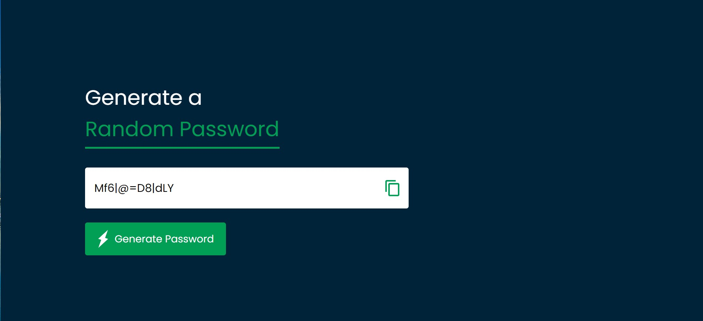

# Random Password Generator

A simple web application that generates a random password with a mix of uppercase letters, lowercase letters, numbers, and symbols.

You can try the live demo of the Random Password Generator project [here](https://random-passwordgenerate.netlify.app/).
 

## Features

- Generates a random password of specified length
- Ensures at least one uppercase letter, one lowercase letter, one number, and one symbol
- Easy-to-use interface

## Technologies Used

- HTML
- CSS
- JavaScript