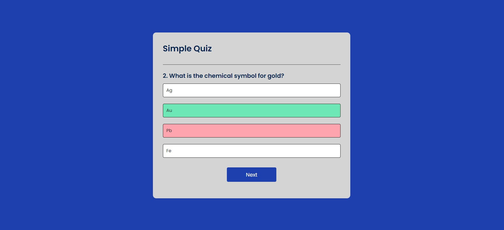

# Simple Quiz Project

This is a simple quiz application built with HTML, CSS, and JavaScript. The quiz consists of multiple-choice questions, and users can select their answers to see their score at the end.

You can try the live demo of the Quiz App project [here](https://simple-quizzz.netlify.app/).

## Features

- Displays multiple-choice questions.
- Shows the correct and incorrect answers.
- Keeps track of the user's score.
- Allows the user to restart the quiz.

## Usage

- Click the "Start Quiz" button to begin.
- Click on one of the multiple-choice answers to select it.
- Your answer will be highlighted in green if correct and in red if incorrect.
- Click the "Next" button to move to the next question.
- At the end of the quiz, your score will be displayed, and you can choose to play again.

## Code Overview

### HTML

The HTML file (`index.html`) contains the basic structure of the quiz application, including the container for the questions and answers, and buttons for navigating the quiz.

### CSS

The CSS file (`styles.css`) provides the styling for the quiz application, including the layout, colors, and hover effects.

### JavaScript

The JavaScript file (`script.js`) contains the logic for the quiz application. Key functions include:

- `startQuiz()`: Initializes the quiz by resetting the question index and score, and displaying the first question.
- `showQuestion()`: Displays the current question and its possible answers.
- `selectAnswer(e)`: Handles the user's answer selection, updating the score and displaying the correct answer.
- `showScore()`: Displays the user's final score at the end of the quiz.
- `handleNextButton()`: Advances to the next question or shows the score if the quiz is finished.
