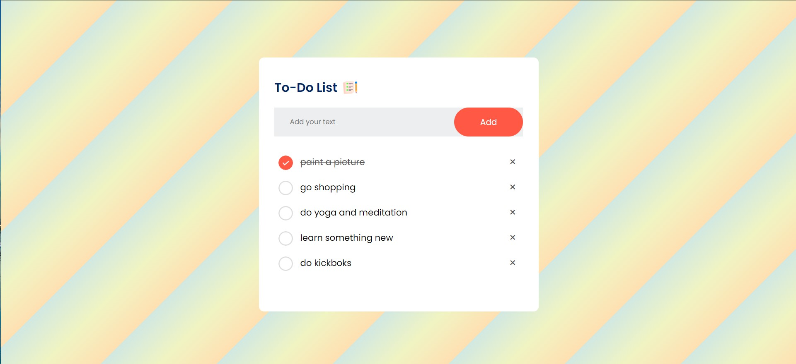

## To-Do App
To-Do List Application is a simple  effective tool for managing tasks. Users can add, complete, and delete tasks with ease. The application utilizes local storage to retain data, ensuring that tasks are preserved even after refreshing the page.

You can try the live demo of the Weather App project [here](https://todoapp-11.netlify.app/). 📝

## Features

- Add tasks
- Mark tasks as complete
- Delete tasks
- Persistent data storage using local storage

## Technologies

- **HTML**: Structure and semantics
- **CSS**: Styling and layout
- **JavaScript**: Functionality and interactivity
